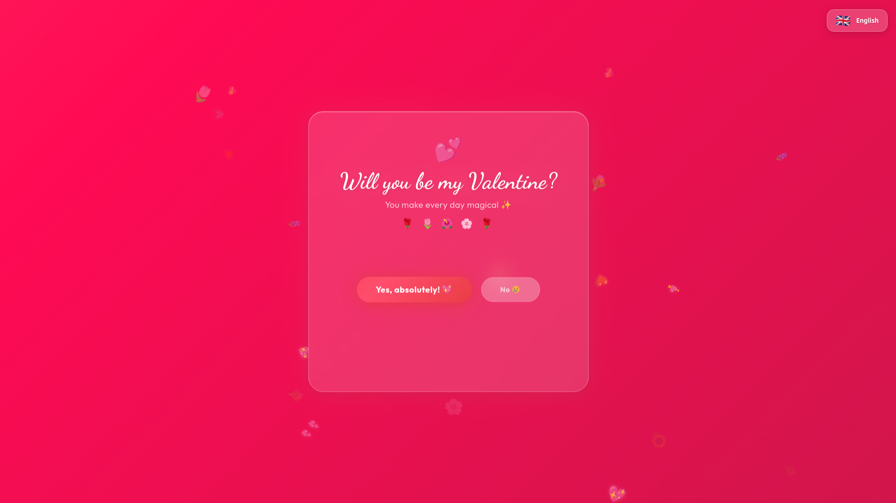
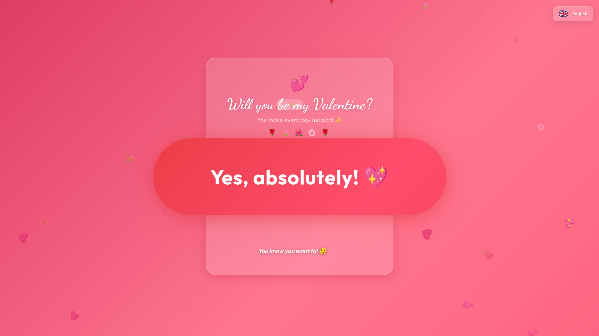
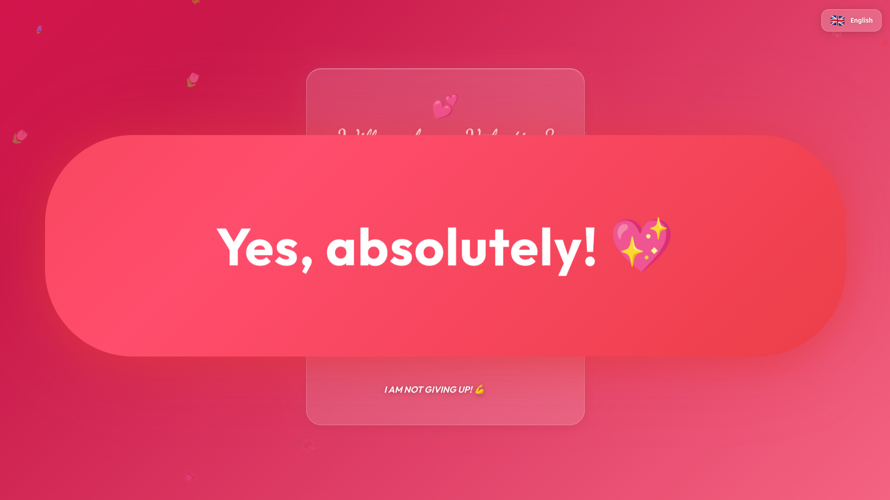
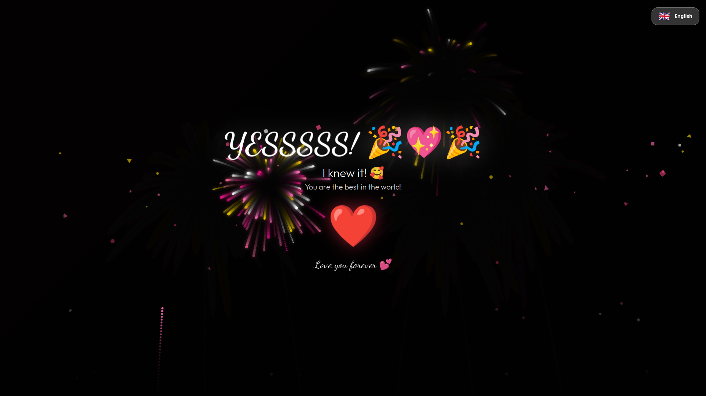
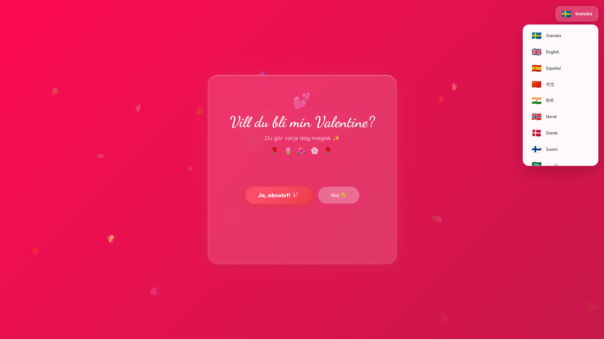
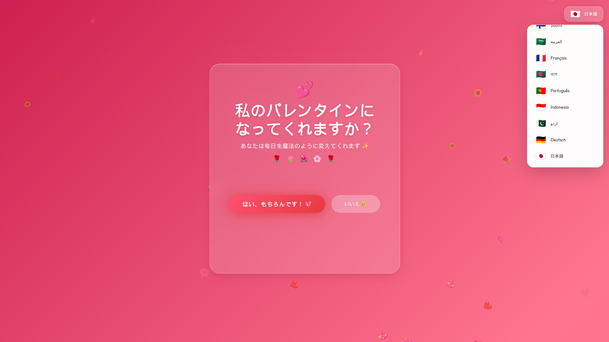

# 💖 Vill du bli min Valentine? 💖

A magical, interactive, and multilingual web experience designed to ask that special someone to be your Valentine. Built with pure HTML, CSS, and vanilla JavaScript for a smooth and delightful experience.

## ✨ Features

- **Interactive Magic**: The "No" button has a personality of its own, growing the "Yes" button and eventually hiding behind it to ensure love always wins.
- **Dynamic Backgrounds**: Floating animated hearts and flowers create a romantic atmosphere.
- **Grand Celebration**: A successful "Yes" triggers a full-screen celebration with custom fireworks, multi-shaped confetti, and explosions of varying heart emojis.
- **Multilingual Support**: Supports 16 different languages with accurate translations:
  - Swedish 🇸🇪 (Original)
  - English 🇬🇧
  - Spanish 🇪🇸
  - Mandarin Chinese 🇨🇳
  - Hindi 🇮🇳
  - Norwegian 🇳🇴
  - Danish 🇩🇰
  - Finnish 🇫🇮
  - Modern Standard Arabic 🇸🇦
  - French 🇫🇷
  - Bengali 🇧🇩
  - Portuguese 🇵🇹
  - Indonesian 🇮🇩
  - Urdu 🇵🇰
  - Standard German 🇩🇪
  - Japanese 🇯🇵
- **Responsive & Premium Design**: Mobile-friendly, high-quality typography (Dancing Script & Outfit), and soft glassmorphism effects with vibrant red pulsing accents.

## 📸 Screenshots

| The more you refuse... | The harder it becomes to say no... |
|-------------------------|------------------------------------|
|  |  |

| Until you can't resist anymore! | JAAAAA! 🎉 |
|---------------------------------|-------------|
|  |  |

### 🌍 One question, sixteen languages!
| Language Picker Page 1 | Language Picker Page 2 |
|-------------------------|------------------------|
|  |  |

## 🚀 How to Run

This is a static website, so it's extremely easy to get started:

1. **Download/Clone** the repository to your local machine.
2. Open `index.html` in any modern web browser.
3. **Recommended**: If using VS Code, use the "Live Server" extension for the best experience.

## 🛠️ Built With

- **HTML5**: For structural semantics.
- **CSS3**: For all the beautiful animations, glassmorphism, and responsive pulsing red accents.
- **Vanilla JavaScript**: For interactive logic, multilingual switching, and particle effects.
- **Google Fonts**: [Dancing Script](https://fonts.google.com/specimen/Dancing+Script) and [Outfit](https://fonts.google.com/specimen/Outfit).

## 📄 License

This project is licensed under the [MIT License](./LICENSE). 💖
